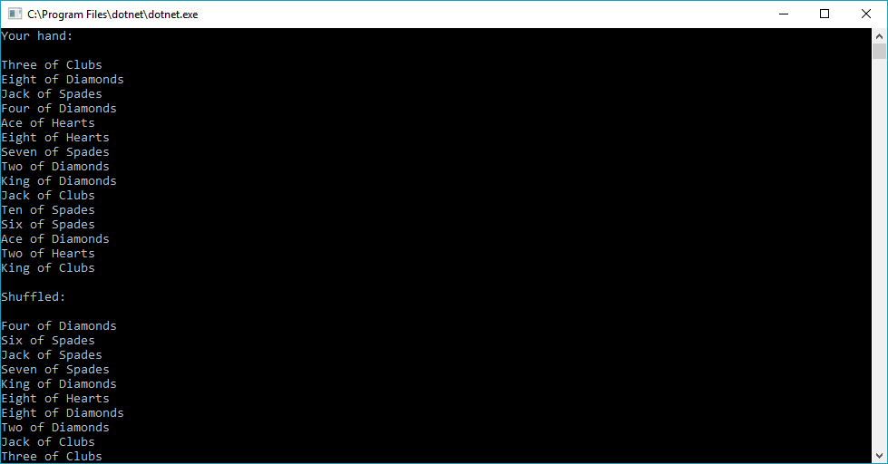

# Deck of Cards

This project is an exercise in utilising Collections in C#.

Inside, Card objects are instantiated and added to a Deck enumeration class.

Methods like Add, Remove, and Shuffle can be called on a collection of cards.

## Visual

## Usage

Clone this repository to local files.

Open Visual Studio

File > Open > Project/Solution

Navigate to where you saved this Repo in your local files

Open the "CardDeck.sln" file

In the top menu, Click Debug > Run without Debugging

